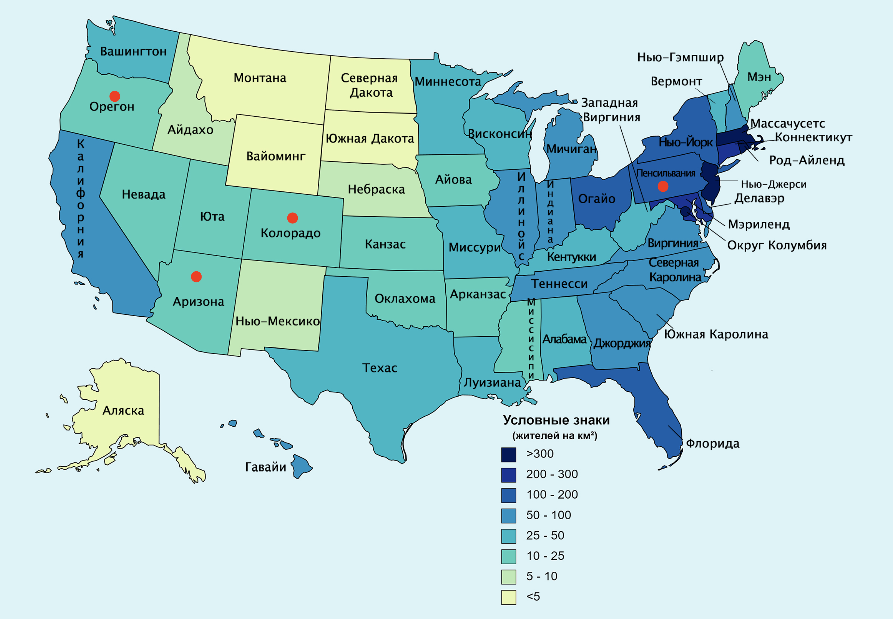
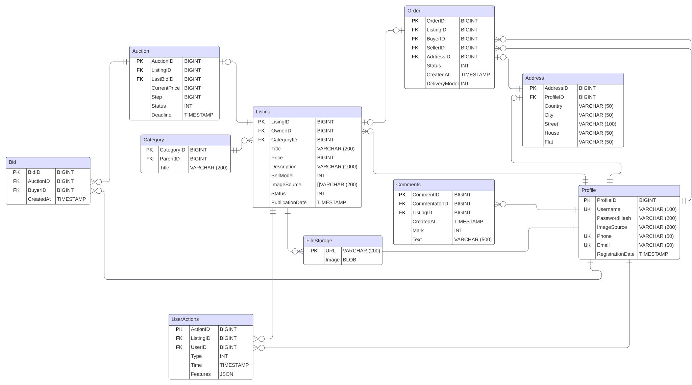

# Проектирование высоконагруженной системы на примере eBay
## Содержание
- [Проектирование высоконагруженной системы на примере eBay](#проектирование-высоконагруженной-системы-на-примере-ebay)
  - [Содержание](#содержание)
  - [1. Тема и целевая аудитория](#1-тема-и-целевая-аудитория)
    - [Основной функционал сервиса](#основной-функционал-сервиса)
    - [Целевая аудитория](#целевая-аудитория)
    - [Основные продуктовые решения:](#основные-продуктовые-решения)
  - [2. Расчет нагрузки](#2-расчет-нагрузки)
    - [Продуктовые метрики](#продуктовые-метрики)
    - [Средний размер хранилища пользователя](#средний-размер-хранилища-пользователя)
    - [Запросы пользователей в день и RPS](#запросы-пользователей-в-день-и-rps)
    - [Сетевой трафик](#сетевой-трафик)
  - [3. Глобальная балансировка нагрузки](#3-глобальная-балансировка-нагрузки)
    - [Обоснования расположения ЦОДов](#обоснования-расположения-цодов)
    - [Расчет распределения запросов по ЦОДам](#расчет-распределения-запросов-по-цодам)
    - [DNS-балансировка](#dns-балансировка)
  - [4. Локальная балансировка нагрузки](#4-локальная-балансировка-нагрузки)
    - [L7 балансировка](#l7-балансировка)
    - [k8s](#k8s)
    - [Отказоустойчивость](#отказоустойчивость)
    - [SSL termination:](#ssl-termination)
  - [5. Логическая схема базы данных](#5-логическая-схема-базы-данных)
    - [ER диаграмма](#er-диаграмма)
    - [Расчет размера данных](#расчет-размера-данных)
  - [5. Физическая схема данных](#5-физическая-схема-данных)
    - [Запросы](#запросы)
    - [Выбор СУБД:](#выбор-субд)
    - [Библиотеки](#библиотеки)
    - [Обеспечение доступности](#обеспечение-доступности)
    - [Поиск](#поиск)
  - [Использованные ресурсы:](#использованные-ресурсы)
## 1. Тема и целевая аудитория
**eBay** - американская компания, предоставляющая услуги в областях 
интернет-аукционов и интернет-магазинов. Основан в 1995 году как первая в мире площадка 
для проведения интернет аукционов. С тех пор сервис активно развивается и на данный момент является
одним из крупнейших маркетплейсов.
### Основной функционал сервиса
* Список объявлений
* Поиск объявлений
* Работа с объявлением (создание, редактирование, удаление)
* Просмотр объявления
* Модерация объявлений
* Профиль пользователя
* Оценить продавца
* Рейтинг продавца
* Статитстика продаж
* Купить товар сразу
* Участвовать в аукционе (сделать ставку)
### Целевая аудитория

По данным с [hypestat](https://hypestat.com/info/ebay.com) и [отчетов ebay.com](https://investors.ebayinc.com/overview/default.aspx):
* 632+ млн сессий в месяц
* 18 млн активных продавцов (активными считаются продавцы, которые опубликовали хотя бы 1 объявление за предыдущие 12 месяцев)
* 132 млн активных покупателей (активными считаются покупатели, которые совершили хотя бы 1 покупку в предыдущие 12 месяцев)
* 135 млн активных пользоввателей суммарно
* 20+ млн сессий в день
* 146+ млн страниц просматривается посетителями ежедневно
* Основная часть покупателей сервиса (≈81%) находится в США
* 2+ млрд активных объявлений

### Основные продуктовые решения:
* Главная модель совершения сделок - аукцион.
* Альтернативная модель совершения сделок в виде функции "Купить сейчас".
* Рекомендательная система на основе действий, совершенных пользователем ранее.
## 2. Расчет нагрузки
### Продуктовые метрики
| Метрика                  | Значение              |
|--------------------------|-----------------------|
| Месячная аудитория MAU** | 45 млн. пользователей |
| Дневная аудитория DAU*   | 18 млн. пользователей |
*Из предположения, что количество уникальных пользователей в день на 10% меньше, чем количество сессий\
** Вычислено исходя из соотношения MAU/DAU аналогичных ресурсов

### Средний размер хранилища пользователя
| Данные                               | Размер ед.      | Кол-во на 1 пользователя | Суммарный объем |
|--------------------------------------|-----------------|--------------------------|-----------------|
| Профиль пользователя (Аватар + ПД)   | 70Кб + 2Кб      | 1                        | 9,05 Tб         |
| Oбъявление (Фотографии + информация) | 1200Кб * 5 + 2Кб| 111 (на 1 продавца)      | 11 Пб          |
| Отзывы                               | 1Кб             | 200  (на 1 продавца)     | 3,35 Тб         |
| Статистические данные по покупателям | 300Байт         | 10000  ( на 1 покупателя)| 360 Тб          |

### Запросы пользователей в день и RPS

Данных по действиям пользователей в день в открытом доступе нет.\
Всего поользователями просматривается порядка 146млн страниц в день => каждый пользователь просматривает примерно 146млн/18млн ≈ 8 страниц в день.
RPS = среднее_кол-во_действий_в_день * DAU / 86400

| Действие                                                | Среднее количество в день на пользователя | RPS  |
|---------------------------------------------------------|:-----------------------------------------:|------|
| Просмотр списка объявлений                              |                    16                     | 3330 |
| Поиск                                                   |                    27                     | 5620 |
| Работа с объявлением (создание/редактирование/удаление) |                     9                     | 1870 |
| Просмотр объявления                                     |                    14                     | 2910 |
| Регистрация/авторизация                                 |                     1                     | 620  |
| Профиль пользователя                                    |                     4                     | 830  |
| Оценка продавца                                         |                     2                     | 410  |
| Просмотр статистики продаж                              |                     2                     | 410  |
| Совершение покупки/ставки                               |                     3                     | 620  |
| Модерация                                               |                     _                     | 1000 |

**Пояснение:**
В [исследовании архитектуры ebay](https://www.softwaresecretweapons.com/jspwiki/resources/presentations/Sun_eBay6-2_forWeb.pdf) указывается,
что 65% от всего трафика ресурса приходится на просмотр объявлений => 5 из 8 просмотренных страниц за сессию - это 
просмотр объявлений (будем исходить из того, что это включает поиск, просмотр списка объявлений и просмотр страницы одного объявления).\
По данным [статьи ](https://o2k.ru/blog/srednyaya-konversiya) можно сделать вывод, что в среднем конверсия в покупку составляет порядка 3%.\
Запросы на модерацию происходят со стороны сотрудников компании, поэтому не могут быть посчитаны аналогично остальным запросам. 
Но можно предположить, что они происходят 1-2 раза на каждое опубликованное объявление.

Получаем средний RPS : 17530. Заложим на пиковый RPS х2 от среднего.\
Получим **пиковую нагрузку в 35060 RPS**.

### Сетевой трафик

Нагрузку на сеть можно расчитать по формуле: нагрузка[Гбит/c] = средний_трафик_на_действие * RPS * 8 / 1024 / 1024

| Действие                                                | Средний трафик на одно действие | Нагрузка на сеть |
|---------------------------------------------------------|:-------------------------------:|------------------|
| Просмотр списка объявлений/ Поиск                       |             5200 Кб             | 354 Гбит/с       |
| Работа с объявлением (создание/редактирование/удаление) |             1440 Кб             | 20,4 Гбит/с      |
| Просмотр объявления                                     |             870 Кб              | 19,3 Гбит/с      |
| Профиль пользователя                                    |             500 КБ              | 3,2 Гбит/с       |
| Регистрация/авторизация                                 |             100 Кб              | 0,4 Гбит/с       |
| Оценка продавца                                         |             100 Кб              | 0,3 Гбит/с       |
| Просмотр статистики продаж                              |             320 Кб              | 1 Гбит/с         |
| Совершение покупки/ставки                               |             250 Кб              | 1,1 Гбит/с       |
| Модерация                                               |             250 Кб              | 1,9 Гбит/с       |

 
Суммарная нагрузка на сеть: 401,6 Гбит/с \
Пусть пиковая нагрузка будет в 2 раз больше, чем средняя (также как для RPS). **Получаем пиковую нагрузку: 802 Гбит/с**

## 3. Глобальная балансировка нагрузки

### Обоснования расположения ЦОДов

В пункте [1. Тема и целевая аудитория](#1-тема-и-целевая-аудитория) обозначили, что более 80% траффика на сервис приходит с территории США.
Однако не смотря на это сервис обслуживает пользователей по всему миру: Европа, Азия, Южная Америка и даже Австралия.

Болшую часть ЦОДов имеет смысл установить на территории США, для этого можно выбрать следующие города:
- Питтсбург, штат Пенсильвания
- Портленд, штат Орегон
- Денвер, штат Колорадо
- Финикс, штат Аризона 

### Расчет распределения запросов по ЦОДам

Будем ориентироваться на карту плотности населения США и географическое положение наших ЦОД:  

| ЦОД       | Примерная область покрытия            | Приблизительный % пользователей | DAU (млн.) | RPS  | Пиковые значения RPS |
|-----------|---------------------------------------|---------------------------------|------------|------|----------------------|
| Питтсбург | Восточная часть США, Европа           | 40                              | 7,2        | 7010 | 14020                |
| Портленд  | Западная часть США, Китай             | 25                              | 4,5        | 4380 | 8760                 |
| Финикс    | Южная часть США, страны Южной Америки | 15                              | 2,7        | 2630 | 5260                 |
| Денвер    | Северная и центральная части США      | 20                              | 3,6        | 3510 | 7020                 |

### DNS-балансировка

Для балансировки нагрузки по регионам будем использовать Latency-based DNS, который будет отправлять запросы клиентов на те
ЦОДы, где минимальный RTT.

[//]: # ()
[//]: # (### CDN)

[//]: # ()
[//]: # (Для снижения времени загрузки страниц и контента будем использовать CDN: контент может быть кэширован на серверах, распределенных)

[//]: # (географически, и пользователь будет получать контент с ближайшего.)

## 4. Локальная балансировка нагрузки
### L7 балансировка
В качестве L7 балансировщика выберем envoy, с помощью него будем распределять запросы между сервисами, поднятыми в k8s.
Одним из преимуществ envoy также является возможность динамического изменения конфигурации.

### k8s
Система оркестрации k8s умеет самостоятельно распределять нагрузку между подами, а также позволяет выполнять автоматическую регуляцию ресурсов в зависимости от нагрузки.

### Отказоустойчивость
Для обеспечения отказоустойчивости системы используем keepalived - реализацию протокола VRRP. 
Таким образом, если один из наших активных серверов будет сбоить - его адрес будет делегирован другому серверу.

В связке с такими возомжностями envoy, как ретраи, мониторинг и circuit breaker получим достаточно высокую отказоустойчивость нашей системы.

### SSL termination:
Для того чтобы снять нагрузку с серверов по расшифровке SSL, это будет делать L7 балансировщик.
## 5. Логическая схема базы данных
### ER диаграмма
   
### Расчет размера данных
| Тип       | Размер (в байтах) |
|-----------|-------------------|
| BIGINT    | 8                 |
| CHAR      | 1                 |
| INT       | 4                 |
| TIMESTAMP | 8                 |

**Listing**
```TeX
  LisingID(8) + OwnerID (8) + CategoryID (8) + Title (200) + Price (8) + Description (1000) + SellModel (4) + ImageSource (1000) + Status (4) + PublicationDate (8) = 2248 байта
``` 
**Profile**
```TeX
   ProfileID (8) + Username (100) + PasswordHash (200) + ImageSource (200) + Phone (50) + Email (50) + Rating (4) + RegistrationDate (8) = 620 байт
``` 
**Auction**
```TeX
   AuctionID (8) + ListingID (8) + LastBidID (8) + CurrentPrice (8) + Step (8) + Status (4) + Deadline (8)=  52 байта
```

**Bid**
```TeX
   BidID (8) + AuctionID (8) + BuyerID (8) + CreatedAt (8) =  32 байта
```

**Order**
```TeX
  OrderID (8) + ListingID (8) + BuyerID (8) + SellerID (8) + AddressID (8) + Status (4) + CreatedAt (8) + DeliveryModel (4) = 56 байта
```
**Address**
```TeX
  AddressID (8) + ProfileID (8) + Country (50) + City (50) + Street (100) + House (50) + Flat (50) = 316 байт
```
**Category**
```TeX
  CategoryID (8) + ParentID (8) + Title (200) = 216 байт
```

**Comment**
```TeX
  CommentID (8) + CommentatorID (8) + ListingID (8) + CreatedAt (8) + Mark (4) + Text (500) = 536 байт
  
```
**UserAction**
```TeX
  ActionID (8) + ListingID (8) + UserID (8) + Type (4) + Time (8) + Features (256)= 292 байт
  
```

| Таблица        | Размер записи (байт) | Количество записей | Итого    |
|----------------|----------------------|--------------------|----------|
| **Listing**    | 2248                 | 2 млрд+3 млрд*     | 10,5 Тб  |
| **Profile**    | 620                  | 200 млн            | 115 Гб   |
| **Auction**    | 52                   | 1,6 млрд**         | 77,5 Гб  |
| **Bid**        | 32                   | 16 млрд***         | 476,8 Гб |
| **Order**      | 56                   | 4 млрд             | 208,6 Гб |
| **Address**    | 316                  | 200 млн            | 58,8 Гб  |
| **Category**   | 216                  | 1000               | 0,2 Мб   |
| **Comment**    | 536                  | 1 млрд             | 449 Гб   |
| **UserAction** | 292                  | 100 млрд****       | 26,6 Тб  |

*Известно, что в сервисе 2млрд активных объявлений, но учитываем, что аналогичные сервисы обычно предоставляют доступ также и к архивным объявлениям, будем считать, что их на 50% больше чем активных\
** В сервисе 2млрд активных объявлений, при этом считаем, что основная модель продаж - аукцион. Предположим, что 80% объявлений выставлены на аукцион, а 20% объявлений прдаются по фиксированной стоимости.\
***Из предположения, что на один аукцион в среднем приходится 10 ставок\
****Считаем, что храним данные о всех действиях пользователей за год\

| Таблица        | Чтение (QPS) | Запись (QPS) |
|----------------|--------------|--------------|
| **Listing**    | 11860        | 3490         |
| **Profile**    | 4360*        | 2000         |
| **Auction**    | 11860**      | 2490         |
| **Bid**        | 11860        | 5500        |
| **Order**      | 2000         | 1500         |
| **Address**    | 4000         | 100          |
| **Category**   | 8950         | -            |
| **Comment**    | 3710         | 500          |
| **UserAction** | 1000         | 30000        |

*Считаем, что при просмотре страницы объявления - также делается запрос на чтение в таблицу поользователей для получения и отображения информации о продавце\
**На всех страницах, где получаются объявления необходимо также отображать информацию о состоянии аукциона.\
***На всех страницах с объявлениями показывается информация о количестве ставок.\

## 5. Физическая схема данных
### Запросы

|Таблица|Запросы|
|-------|--------|
|Listing| ```SELECT ListingID, OwnerID,   CategoryID,   Title,   Price,   Description, SellModel , ImageSource  ,Status ,PublicationDate FROM Listing WHERE ListingID=...``` - получение объявления по идентификатору<br> ```SELECT ListingID, OwnerID,   CategoryID,   Title,   Price,   Description, SellModel , ImageSource  ,Status ,PublicationDate FROM Listing WHERE ... LIMIT N OFFSET M``` - получение списка объявлений с фильтрацией (по CategoryID,OwnerID, Price  и т.д.)<br>```INSERT INTO Listing  (ListingID, OwnerID,   CategoryID,   Title,   Price,   Description, SellModel , ImageSource  ,Status ,PublicationDate) VALUES (...)```- создание объявления <br>  ```UPDATE Listing SET ... WHERE ListingID= ...```- редактирование объявления 
|Profile|```SELECT ProfileID, Username, PasswordHash, ImageSource , Phone, Email, Rating, RegistrationDate FROM Profile  WHERE ProfileID=...``` -  получение данных о пользоавтеле по идентификатору<br>```INSERT INTO Profile  (ProfileID, Username, PasswordHash, ImageSource , Phone, Email, Rating, RegistrationDate ) VALUES (...)```- создание профиля пользователя<br> ```UPDATE Profile  SET ... WHERE ProfileID=...```- редактирование профиля пользователя<br> 
|Auction|```SELECT AuctionID , ListingID, LastBidID, CurrentPrice, Step, Status, Deadline FROM Auction  WHERE ListingID=...``` - получение информации об аукционе<br>```INSERT INTO Auction  (AuctionID , ListingID, LastBidID, CurrentPrice, Step, Status, Deadline) VALUES (...)```- создание профиля нового аукциона<br> ```UPDATE Auction SET ... WHERE AuctionID=...```- редактирование информации об аукционе<br> 
|Bid|```SELECT BidID , AuctionID, BuyerID, CreatedAt FROM Bid  WHERE AuctionID=... LIMIT N OFFSET M``` - получение информации о ставках на аукционе<br>```SELECT BidID , AuctionID, BuyerID, CreatedAt FROM Bid  WHERE BuyerID=... LIMIT N OFFSET M``` - получение информации о ставках  пользователя<br>```INSERT INTO Bid  (BidID , AuctionID, BuyerID, CreatedAt ) VALUES (...)```- создание ставки<br> 
|Order|```SELECT OrderID , ListingID, BuyerID, SellerID , AddressID, Status, CreatedAt, DeliveryModel FROM Order  WHERE OrderID=...``` - получение информации о заказе по идентификатору<br>``````SELECT OrderID , ListingID, BuyerID, SellerID , AddressID, Status, CreatedAt, DeliveryModel FROM Order  WHERE ... LIMIT N OFFSET M``` - получение информации о заказе по BuyerID/SellerID и доп фильтрам (например, статусу или дате создания)<br>```
### Выбор СУБД:
В качестве основной базы данных будем использоватьь СУБД Postgres.

Для сбора статистических данных будем использовать ClickHouse.

Для хранения клиентских сессий и кеширования некритичных данных будем использовать Redis Cluster, который включает в себя набор хостов,
на которых хранятся данные и делится на шарды, каждый из которых состоит из мастера и набора реплик.

Для хранения фотографий будем использовать сетевую файловую систему (CEPH) по следующим причинам:
- масштабируеемость
- отказоустойчивость
- гибкость 

Для поиска будем использовать поисковую систему ElasticSearch. Поиск может совершаться по различным полям: название, описание, характеристики товара.

### Библиотеки
PostgreSQL: jackc/pgx

Redis: go-redis

ClickHouse: clickhouse/clickhouse-go

Elasticsearch: olivere/elastic

CEPH: go-ceph

### Обеспечение доступности
  
**Шардинг**

Объявления предлагается хранить следующим образом:
- Неактивные объявления (удаленные, проданные) храним в отдельном  шарде - это архивная информация, нагрузка на чтение небольшая. После истечения срока, установленного офертой, данные будут удаляться полностью. Набор шардов формируется по времени - 1 шард на 1 месяц.
- Активные объявления будут шардироваться по хэшу от ключа. Выделим на это 100 шардов - по 20 млн записей в каждом. 
  
Данные об аукционах и ставках будем шардировать по хэшу от AuctionID.

Информацию о пользователях шардируем по хэшу от ProfileID.

Информацию о заказах шардируем по хэшу OrderID.

**Репликация**
Для каждого шарда будем использовать master-slave репликацию, чтобы распределить 
читающую и пишущую нагрузку между разными узлами.

**Ограничения**
Использование такой стратегии накладывает следующие ограничения:
- JOIN`ы выполняются исключительно на уровне кода
- Не используем транзакции

**Индексы**
1. Listing

• Primary Key: ListingID

• Индексы:

  • OwnerID (для поиска всех лотов владельца)

  • CategoryID,Status (для фильтрации по категории)

  • Status (для поиска активных/неактивных лотов)

  • CategoryID, PublicationDate (для сортировки или фильтрации по дате публикации)

▎2. Profile

• Primary Key: ProfileID

• Индексы:

  • Username (для быстрого поиска по имени пользователя)

  • Email (для проверки уникальности и быстрого поиска по email)

▎3. Auction

• Primary Key: AuctionID

• Индексы:

  • ListingID (для соединения с таблицей Listing)
  
▎4. Bid

• Primary Key: BidID

• Индексы:

  • AuctionID (для соединения с таблицей Auction)

  • BuyerID (для поиска всех ставок конкретного покупателя)

▎5. Order

• Primary Key: OrderID

• Индексы:

  • BuyerID, Status (для поиска всех заказов конкретного покупателя)

  • SellerID, Status  (для поиска всех заказов конкретного продавца)

▎6. Address

• Primary Key: AddressID

• Индексы:

  • ProfileID (для поиска адресов по пользователям)

▎7. Category

• Primary Key: CategoryID

• Индексы:

  • ParentID (для организации иерархии категорий)

▎8. Comment

• Primary Key: CommentID

• Индексы:

  • ProfileID (для поиска отзывов по продавцу)

### Поиск
Поиск будет вестисть по объявлениям, поэтому в ElasticSearch  будут храниться данные об активных объявлениях.
Elastic Search также требует масштабирования:  разобъем его на шарды по 256Гб.
Также нам важно поддерживать актуальность объявлений в поиске, поэтому поисковый индек будет обновляться "на лету" чтобы синхронизироваться с основным хранилищем.

---
## Использованные ресурсы:
1. https://hypestat.com/info/ebay.com
2. https://www.ebayinc.com/company/
3. https://investors.ebayinc.com/overview/default.aspx
4. [eBay Creates Technology Architecture for the Future By David S. Marshak](https://www.softwaresecretweapons.com/jspwiki/resources/presentations/Sun_eBay6-2_forWeb.pdf) 
5. https://ceur-ws.org/Vol-2311/paper_14.pdf
6. http://jaoo.dk/dl/qcon-london-2008/slides/RandyShoup_eBaysArchitecturalPrinciples.pdf
